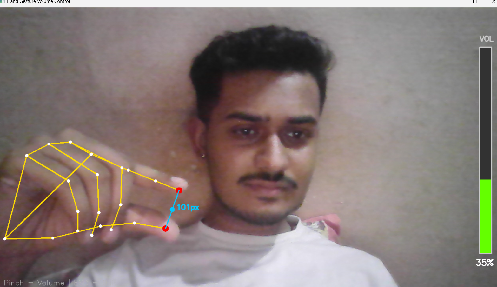
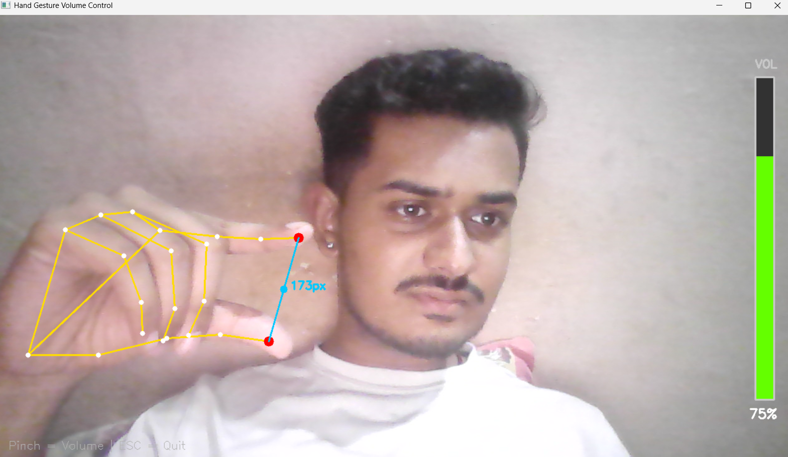

<div align="center">

# ✋ Hand Gesture Volume Control

### Control Your System Volume Using Hand Gestures in Real-Time



</div>

---

## 🚀 Overview

This project allows you to control your system volume using only your hand gestures through a webcam.

Using **MediaPipe Hand Tracking**, the distance between your **thumb** and **index finger** is detected and mapped directly to your system's volume level.

---

## ✨ Features

- 🎥 Real-time webcam hand tracking
- ✋ Gesture-based volume control
- 🔊 Smooth volume adjustment
- 📊 Animated volume bar UI
- ⚡ Real-time performance
- 🖥️ Windows system volume integration
- 🤏 Pinch gesture detection

---

## 📸 Demo

### Hand Tracking Detection


---

### Gesture Volume Control



---

## 🛠️ Tech Stack

- Python
- OpenCV
- MediaPipe
- NumPy
- Pycaw
- Computer Vision

---

## 📂 Project Structure

```bash
Hand-Gesture-Volume-Control/
│
├── app.py
├── requirements.txt
├── hand_landmarker.task
├── README.md
│
└── public/
    └── demo/
        ├── demo.png
        └── demo2.png
```

---

## ⚙️ Installation

### 1️⃣ Clone Repository

```bash
git clone https://github.com/harshdwivediiiii/Hand-Gesture-Volume-Control.git
```

### 2️⃣ Move into Folder

```bash
cd Hand-Gesture-Volume-Control
```

### 3️⃣ Install Dependencies

```bash
pip install -r requirements.txt
```

---

## 📦 Requirements

```txt
opencv-python
mediapipe
numpy
pycaw
comtypes
```

---

## ▶️ Run the Project

```bash
python app.py
```

---

## 🎮 Controls

| Gesture | Action |
|----------|---------|
| 🤏 Fingers Close | Volume Down |
| ✋ Fingers Apart | Volume Up |
| ESC Key | Exit Application |

---

## 🧠 How It Works

1. Webcam captures live video
2. MediaPipe detects hand landmarks
3. Thumb & index finger positions are tracked
4. Distance between fingers is calculated
5. Distance maps to system volume
6. Volume changes smoothly in real time

---

## 🔥 Concepts Used

- Hand Landmark Detection
- Gesture Recognition
- Euclidean Distance Calculation
- Real-Time Computer Vision
- Volume Mapping

---

## 🚀 Future Improvements

- 🖐️ Multi-hand support
- 🎵 Media player controls
- 🌙 Futuristic UI
- 📱 Mobile camera support
- 🤖 Custom gesture commands

---

## 👨‍💻 Author

### Harshvardhan Dwivedi

---

## ⭐ Support

If you liked this project:

- ⭐ Star the repository
- 🍴 Fork the project
- 📢 Share it with others

---

## 📜 License

This project is licensed under the MIT License.
